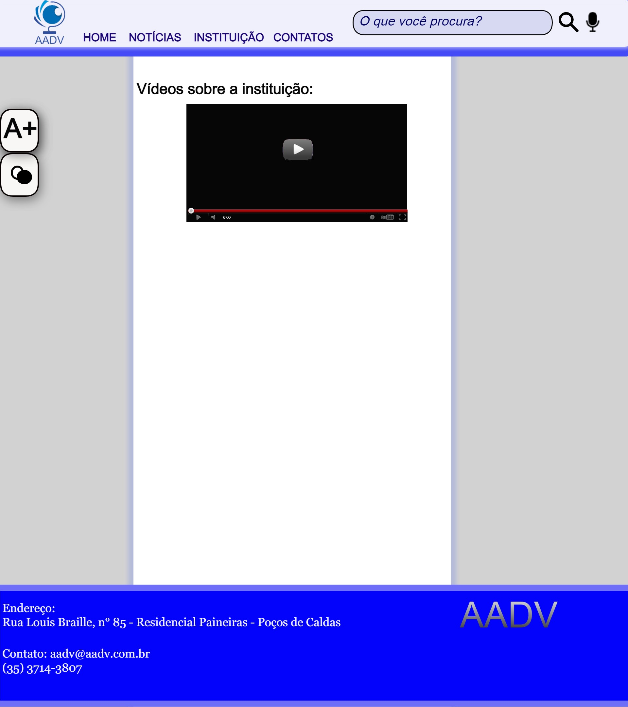

# Projeto de Interface

Pré-requisitos: <a href="2-Especificação do Projeto.md"> Documentação de Especificação</a>

 Seguindo uma linha de pesquisas, para usuários com deficiência visual e com baixa visão, adaptamos o site para ter uma paleta de cores mais suaves nas partes textuais e com cores vibrantes, para facíl diferênciação de cores, também usamos as cores da instituição para o design, colocamos os botões laterais para mudar a escala de cores de um fundo claro com letra escura para um de fundo escuro com letras mais claras a fim de facilitar o entendimento do texto, adicionamos também o botão para aumentar a fonte dos textos do site para os usuários de baixa visão conseguirem com maior facilidade entender o texto, também adicionamos vídeos as paginas para relatar o conteúdo apresentado em cada aba. 
 

