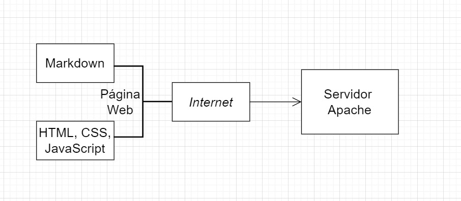

# Arquitetura da Solução

Pré-requisitos: <a href="3-Projeto de Interface.md"> Projeto de Interface</a>

O conteúdo das páginas será escrito em arquivos Markdown pelos funcionários da AADV.
A partir desses arquivos Markdown:
* É executado um script que converte esses arquivos em HTML, e o resultado é transferido para o servidores.
* Ou eles são transferidos para o servidor, e este irá processar o Markdown em HTML, CSS e Javascript.

## Diagrama de componentes

Os componentes que fazem parte da solução são apresentados na Figura 01.

Figura 01 - Arquitetura da Solução

A solução implementada conta com os seguintes módulos:
- **Navegador** - Programa usado para acessar o site
  - **Páginas Web** - Conjunto de arquivos HTML, CSS, JavaScript criados a partir de arquivos Markdown. O conteúdo atualizado é obtido dos servidores web.
- **Hospedagem** - Servidor web da própria AADV
- **Script para conversão** - Ferramenta criada para converter os arquivos Markdown em páginas web.

## Tecnologias Utilizadas

* VS Code
* Markdown
* Servidor Web Apache

## Hospedagem

Servidor web da própria AADV
